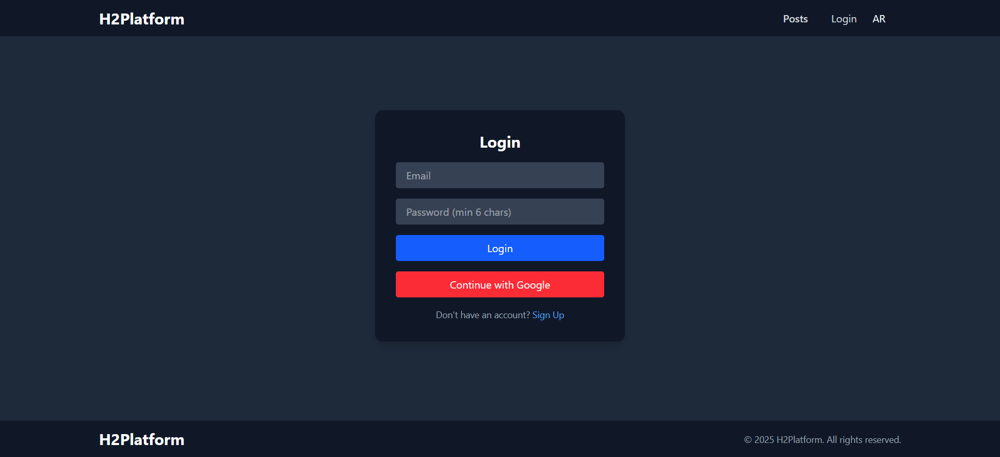
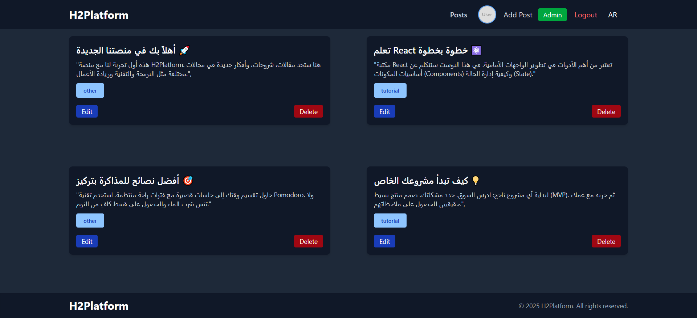

<!-- @format -->

# H2Platform Blog

A responsive blog platform built with **React.js**, **Redux Toolkit**, **Firebase Authentication**, and **Tailwind CSS**.  
It supports **multi-language (i18next)**, **role-based access (Admin / Reader)**, and post management (create, edit, delete, list posts).

---

## ✨ Features

- 🔑 **Authentication**

  - Email/Password login
  - Google OAuth login
  - Protected routes with Firebase

- 👥 **Role-based Access**

  - **Admin** → can add, edit, delete posts
  - **Reader** → can only view posts

- 📝 **Post Management**

  - Add new posts with title, content, category, and image
  - Edit and delete posts
  - Save posts in localStorage

- 🌐 **Internationalization (i18next)**

  - Switch between English and Arabic

- 🎨 **UI/UX**
  - Responsive design with **Tailwind CSS**
  - Navbar, footer, post cards
  - Dark/Light theme support (optional)

---

## 🛠️ Tech Stack

- [React.js](https://react.dev/) – UI library
- [Redux Toolkit](https://redux-toolkit.js.org/) – State management
- [Firebase](https://firebase.google.com/) – Authentication & Firestore
- [Tailwind CSS](https://tailwindcss.com/) – Styling
- [React Router](https://reactrouter.com/) – Navigation
- [i18next](https://www.i18next.com/) – Translations

---

## 🚀 Getting Started

### 1. Clone the repo

```bash
git clone https://github.com/Ehab-Elshahat/h2platform.git
cd h2platform-blog

2. Install dependencies
  npm install

3. Firebase setup

  . Go to Firebase Console

  . Create a new project.

  . Enable Authentication → Sign-in methods:

  . Email/Password

  . Google

  . Copy your Firebase config and replace it in src/firebase.js.

  // src/firebase.js
  import { initializeApp } from "firebase/app";
  import { getAuth } from "firebase/auth";
  import { getFirestore } from "firebase/firestore";

  const firebaseConfig = {
    apiKey: "YOUR_KEY",
    authDomain: "YOUR_DOMAIN",
    projectId: "YOUR_PROJECT_ID",
    storageBucket: "YOUR_BUCKET",
    messagingSenderId: "YOUR_SENDER_ID",
    appId: "YOUR_APP_ID",
  };

  const app = initializeApp(firebaseConfig);

  export const auth = getAuth(app);
  export const db = getFirestore(app);

4. Run the project

  npm run dev

  Open 👉 http://localhost:5173

📂 Project Structure

  src/
 ├── components/     # Reusable UI components
 ├── pages/          # App pages (Login, Posts, AddPost, etc.)
 ├── redux/          # Redux slices (auth, posts, isAdmin)
 ├── i18n/           # Translation files
 ├── firebase.js     # Firebase configuration
 └── App.jsx         # Main app entry


 # Screenshot





👨‍💻 Author

Developed by Ehab Elshahat
Frontend Developer (React, Redux, Tailwind, Firebase)

```
